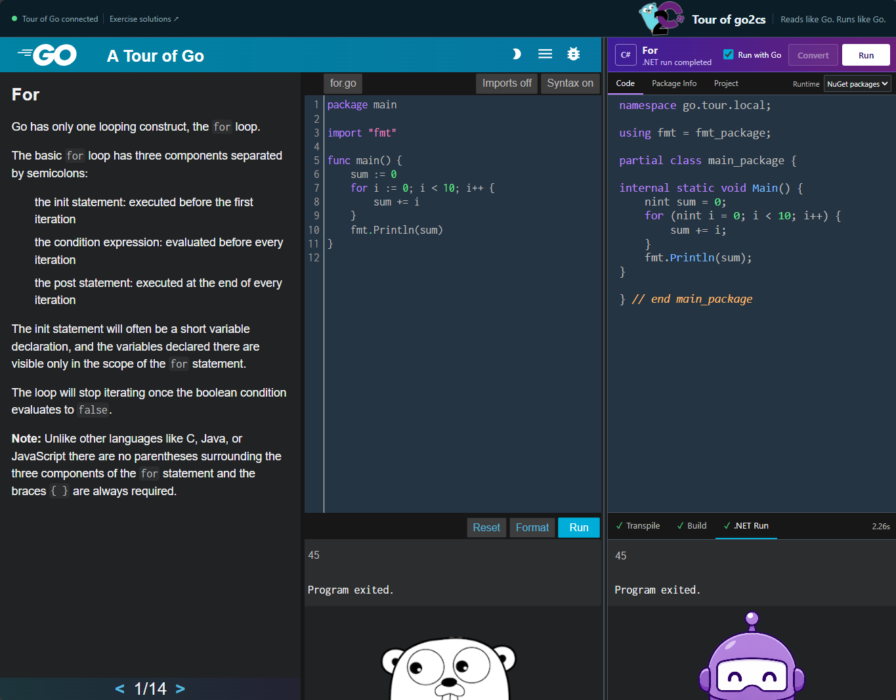

# go2cs — Go to C# Converter

[
](https://www.nuget.org/packages/go.lib)

Browse all: [Go Standard Library NuGet packages](https://www.nuget.org/packages?q=go2cs%20ritchiecarroll)

---

## 📰 NEWS — July 26, 2026: More than a quarter of the standard library's test suites pass in C#

**57 of the 215 converted standard-library packages that define `Test` functions now run their own Go
1.23.1 test suites in C# and agree with `go test -json` verdict for verdict — 26.5%.** That is
**1,459 matching test results**, with 47 divergences disclosed by exact failure signature rather than
skipped. The set reaches well past leaf packages: `sync`'s own concurrency suite, the full RE2 engine in
`regexp`, `strconv`'s float formatting at full precision, the reflection-driven ones (`errors`,
`encoding/binary`, `internal/fmtsort`, and `go/token` — which round-trips a `FileSet` through the real
converted `encoding/gob` engines), and `hash/crc32` running genuine SSE4.2/PCLMULQDQ hardware paths
through managed intrinsics. Full per-package counts, and a
[one-command reproduction](#try-it-yourself--validate-a-converted-test-suite) from a clone, are in the
[validated-package table](ValidatedTestPackages.md).

**➡ All announcements can be found in the [go2cs News Archive](NEWS.md).**

## go2cs Purpose

Convert source code written in the [Go programming language](https://golang.org/ref/spec) into
[C#](https://learn.microsoft.com/dotnet/csharp/). The generated C# is designed to be both *behaviorally*
and *visually* similar to the original Go — so a Go developer can read the converted code and follow it
easily, and a .NET developer can use Go code directly within the .NET ecosystem.

* Browse transpiled code: [Converted Go Standard Library](https://github.com/ritchiecarroll/go2cs/tree/master/src/core)
* Explore Go and generated C# side by side: [Tour of go2cs](https://github.com/ritchiecarroll/go2cs/blob/master/src/tour/README.md)
* Learn how it works: [Go to C# Conversion Strategies](ConversionStrategies.md)
* Walk through an example: [Converting a real-world module](#converting-a-real-world-module)
* Compile in Visual Studio: [Go Standard Library Solution](https://github.com/ritchiecarroll/go2cs/blob/master/src/go2cs-stdlib.slnx)
* Run converted Go test validation: [Try it yourself](#try-it-yourself--validate-a-converted-test-suite)
* Track which stdlib test suites pass in C#: [Validated Test Packages](ValidatedTestPackages.md)
* View example converted test: [`utf8_test.cs`](https://github.com/ritchiecarroll/go2cs/blob/master/src/core/unicode/utf8/utf8_test.cs)
* See current project [status](#status) and [milestones](#milestones)

[](images/tour-of-go2cs.png)

### Frequently asked questions

* Why is a Go to C# transpiler needed? _[Integration opportunities](https://go2cs.net/Background.html#background)._
* Won't converted C# code be slower? _[Yes, slower is expected](https://go2cs.net/#performance)._

## Transpiler Goals

Go provides a lot of high-level functionality from its compiler and runtime — slices, maps, channels,
goroutines, `defer`/`panic`/`recover`, multiple return values, struct embedding, and interface
duck-typing. go2cs maps each of these onto idiomatic C#, keeping the machinery out of sight (in a small
runtime library and compile-time source generators) so the converted code stays close to the original Go.

- **Reads like Go.** Receiver methods become extension methods, multiple returns become tuples, struct
  embedding becomes promoted fields — the shape of the code is preserved.
- **Runs like Go.** Conversions prioritize behavioral equivalence first (e.g. a `goroutine` runs on the
  thread pool rather than being rewritten into `async`).
- **Managed first.** Output targets portable managed C#; native interop is a last resort, not the default.

## Example

Given this Go:

```go
type Person struct {
    name string
    age  int32
}

func (p Person) IsAdult() bool {
    return p.age >= 18
}
```

go2cs produces this C#:

```csharp
[GoType] partial struct Person {
    internal @string name;
    internal int32 age;
}

public static bool IsAdult(this Person p) {
    return p.age >= 18;
}
```

### Real standard-library conversions, side by side

The goal — *reads like Go* — is easiest to judge on real code. Below are a few converted standard-library
files next to their original **Go 1.23.1** source. Start with `errors`, then work down as the constructs get
richer:

| Package | Go 1.23.1 source | Converted C# | What it shows |
|:--|:--|:--|:--|
| `errors` | [errors.go](https://github.com/golang/go/blob/go1.23.1/src/errors/errors.go) | [errors.cs](https://github.com/ritchiecarroll/go2cs/blob/master/src/core/errors/errors.cs) | Error values and an unexported type satisfying the `error` interface. |
| `cmp` | [cmp.go](https://github.com/golang/go/blob/go1.23.1/src/cmp/cmp.go) | [cmp.cs](https://github.com/ritchiecarroll/go2cs/blob/master/src/core/cmp/cmp.cs) | Generics with an ordered-type constraint. |
| `unicode/utf8` | [utf8.go](https://github.com/golang/go/blob/go1.23.1/src/unicode/utf8/utf8.go) | [utf8.cs](https://github.com/ritchiecarroll/go2cs/blob/master/src/core/unicode/utf8/utf8.cs) | Constants keeping Go's hex/binary literal formatting; arrays and structs. |
| `sort` | [search.go](https://github.com/golang/go/blob/go1.23.1/src/sort/search.go) | [search.cs](https://github.com/ritchiecarroll/go2cs/blob/master/src/core/sort/search.cs) | Binary search driven by a `func(int) bool` closure. |
| `strings` | [reader.go](https://github.com/golang/go/blob/go1.23.1/src/strings/reader.go) | [reader.cs](https://github.com/ritchiecarroll/go2cs/blob/master/src/core/strings/reader.cs) | A struct with receiver methods, tuple returns, and interface implementation. |
| `container/list` | [list.go](https://github.com/golang/go/blob/go1.23.1/src/container/list/list.go) | [list.cs](https://github.com/ritchiecarroll/go2cs/blob/master/src/core/container/list/list.cs) | A doubly-linked list — pointers and receiver methods. |

Browse the whole set under [`src/core`](https://github.com/ritchiecarroll/go2cs/tree/master/src/core).

## Features

go2cs converts the full Go language surface — the same converter that emits the 302 packages above. What
that covers, grouped:

**Types & values**

- Slices and arrays (backing-array aliasing preserved, as in Go), maps, and UTF-8-backed `@string`
- `int` / `uint` mapped to platform-width native integers; named numeric types and untyped-constant semantics
- Constants and `iota`, preserving Go's numeric literal formatting (hex, binary, underscores, exponents)
- Pointers with automatic heap-boxing driven by escape analysis; the `nil` value; `unsafe.Pointer`
- Type definitions and type aliases — including exported aliases that resolve across package/assembly boundaries

**Functions & methods**

- Multiple return values and named results, as tuples
- Receiver methods as extension methods, with distinct pointer- and value-receiver overloads
- Function values, closures (honoring Go's shared-storage capture semantics), and variadic functions
- `defer` / `panic` / `recover`, including named results observed and mutated by deferred closures

**Concurrency**

- Goroutines, run on the thread pool (behavioral equivalence first — not rewritten into `async`)
- Channels with channel-operator (`<-`) lowering, and `select`-statement lowering

**Composition & polymorphism**

- Structs and struct embedding, with promoted fields and methods (multi-hop and cross-package)
- Interfaces, satisfied structurally in Go and realized as nominal C# glue via Roslyn source generators
- Type assertions and type switches
- Generics: type parameters and constraints (unions, `comparable`, `~`-underlying, and method-set constraints)

**Control flow & packaging**

- `for` / `range`, labeled `break` / `continue`, expression and type switches, and Go 1.22 per-iteration loop variables
- The built-ins: `append`, `len`, `cap`, `make`, `new`, `copy`, `delete`, `close`, …
- Packages mapped to namespaces, with cross-package imports compiled as separate, referenced assemblies
- Build-tag and `GOOS` / `GOARCH` platform file selection, and deterministic, byte-stable output

See [`ConversionStrategies.md`](ConversionStrategies.md) for an example-driven tour of how each construct
maps to C# (with [`ConversionStrategies-Reference.md`](ConversionStrategies-Reference.md) for the full detail).


## Requirements

- **[.NET 9.0 SDK](https://dotnet.microsoft.com/download)** — to build and run the converted C#.
- **[Go 1.23+](https://go.dev/dl/)** — the converter is a Go program, and it uses the Go toolchain to load
  and type-check the source being converted. Make sure your Go environment is set up (`GOROOT`/`GOPATH`)
  and the source you want to convert already builds with `go build`.

## Installing the converter

Build the `go2cs` executable from source and place it on your `PATH`. The simplest way is `go install`,
which compiles it and drops the binary into `%GOBIN%` (or `%GOPATH%\bin`) — already on your `PATH` in a
standard Go setup — in one step:

```shell
cd src/go2cs
go install .
```

Go produces a self-contained native binary. To target another platform, use Go's standard cross-compilation
(`GOOS`/`GOARCH`).

## Usage

```shell
go2cs [options] <input_dir> [output_dir]
```

Examples:

```shell
go2cs example.go                       # convert a single file
go2cs package_dir                      # convert a package
go2cs -indent 2 -var=false example.go conv/example.cs
go2cs -stdlib                          # convert the entire Go standard library
go2cs -stdlib fmt strings io           # convert specific standard library packages
go2cs -recurse=nuget module_dir out    # convert a module + its third-party deps, stdlib from NuGet
go2cs -recurse module_dir              # same, referencing a locally-staged standard library
go2cs -recurse module_dir output_root  # ...with the generated app/dep trees under output_root
go2cs -tests package_dir               # convert a package plus its Go test suite
go2cs -tests -test-action all goroot_pkg_dir converted_pkg_dir   # ...and build, run, and diff vs go test
```

### Common options

| Option | Description |
|:--|:--|
| `-stdlib` | Convert the Go standard library (optionally followed by specific package names). |
| `-recurse` | Recursively convert a downloaded module **and its third-party dependencies** in dependency order, referencing (not reconverting) the pre-converted standard library. `-recurse=nuget` takes that standard library, the `golib` runtime and the analyzer from NuGet — [`go.<pkg>`](https://www.nuget.org/packages?q=go2cs%20ritchiecarroll) + [`go.lib`](https://www.nuget.org/packages/go.lib) + [`go.gen`](https://www.nuget.org/packages/go.gen) — so the generated projects restore the whole go2cs stack with nothing staged locally; plain `-recurse` references a locally-staged deploy root through `$(go2csPath)` instead. Either way the app's own and third-party converted packages stay project references. Pass an optional second positional output root to isolate the generated `src\` app and `pkg\` dependency trees from `-go2cspath`; references inside that converted graph are relative. See [Converting a real-world module](#converting-a-real-world-module). |
| `-tests` | Also convert the package's eligible `_test.go` suite and emit a runnable C# test-host project alongside the converted package (default off; cannot be combined with `-recurse`). Defaults to `-comments` on, resolves the output path to absolute, and self-locates `$(go2csPath)` by walking up from the output directory to the first root containing `core\golib` — so the canonical two-argument form `go2cs -tests -test-action all <goroot-package-dir> <converted-package-dir>` works from a bare clone with no flags or environment setup. See [Try it yourself — validate a converted test suite](#try-it-yourself--validate-a-converted-test-suite) for a worked example. |
| `-test-action <action>` | With `-tests`: one of `convert` (default), `build`, `run`, `compare`, or `all`. `convert` and `all` convert the package and its tests; `build` / `run` / `compare` act on the **existing** converted artifacts — validated against the test manifest's recorded input digest — without reconverting. `compare` (and `all`, after converting) runs both `go test -json -count=1` and the converted C# test host and diffs the terminal results by test name. |
| `-test-timeout <duration>` | Package deadline for a converted-test action (build / run / compare), in Go duration syntax (default `2m`; must be positive). For `run`/`compare` it is handed to **both** sides — `go test -timeout` and the converted host's own `-timeout` — so they agree; the child process itself is killed one minute later, purely as a safety net for a child that ignores its own deadline. A suite that legitimately runs long needs a value above **both** defaults (each side otherwise falls back to its own 10-minute default): `hash/maphash` takes ~15 minutes in C# where Go's takes 7.6 seconds, so it is validated with `-test-timeout 30m`. |
| `-go2cspath <dir>` | Runtime/stdlib root (env `GO2CSPATH`; default `~/go2cs`) used by generated `$(go2csPath)…` references, and the output root for `-stdlib`. It remains the default `-recurse` output root for compatibility, but `go2cs -recurse <input> <output>` writes the app/dependency graph to the explicit output instead. For a single-package/file conversion, C# output goes to optional `[output_dir]` (in place by default). |
| `-goroot` / `-gopath` | Override the detected Go root / path. |
| `-platforms <os/arch>` | Target platform for build-tagged files (defaults to the host). |
| `-indent <n>` | Spaces per indent level (default 4). |
| `-var` | Prefer `var` declarations where the type is obvious (default on). |
| `-uco` | Emit channel operators instead of method calls (default on). |
| `-comments` | Carry source comments into the output (best effort, see [go/ast comment status](https://github.com/golang/go/issues/20744)). |
| `-csproj <file>` | Generate project files from a custom `.csproj` template instead of the embedded one. |
| `-tree` | Print each file's Go parse tree (`go/ast`) to stdout during conversion — a diagnostic aid. |
| `-debug` | Debug mode: disables the converter's per-file panic recovery, so a conversion failure crashes with a full stack trace instead of being reported as a warning. |
| ~~`-cgo`~~ | ~~Also convert cgo-targeted files.~~ |

All converted C# code references a hand-written runtime library (`golib`, published as the [`go.lib`](https://www.nuget.org/packages/go.lib)
NuGet package) plus a set of Roslyn source generators that supply Go semantics at compile time (published as
[`go.gen`](https://www.nuget.org/packages/go.gen)). A `-recurse=nuget` conversion wires both up for you.

### Converting a real-world module

The `-recurse` option converts a **whole downloaded application together with
every third-party dependency package** in its transitive import closure — in dependency order
(least-dependencies-first) — while **referencing** (not reconverting) the pre-converted standard library.
The result is a C# solution you can open and build.

With `-recurse=nuget` that standard library, the `golib` runtime and the `go2cs-gen` analyzer come from
[nuget.org](https://www.nuget.org/packages?q=go2cs%20ritchiecarroll) as the `go.<pkg>` / `go.lib` / `go.gen`
packages, so nothing has to be staged on the machine beforehand — the generated projects pull in the go2cs
stack the way any other .NET dependency arrives. (Prefer the standard library as local C# source? See
[building against a local standard library](#optional-build-against-a-local-standard-library) below.)

Here is the full round-trip for a small CLI that uses [`github.com/fatih/color`](https://github.com/fatih/color),
which itself pulls in `github.com/mattn/go-colorable`, `github.com/mattn/go-isatty`, and `golang.org/x/sys` —
a genuine dependency graph:

> **NOTE:** _to date, the following steps have only been tested on Windows — instructions assume `cmd.exe` type shell._

**1 — Go: get the app and confirm it builds as Go.**

```bat
mkdir colordemo && cd colordemo
go mod init example.com/colordemo
```

Create `main.go` (`go mod tidy` needs a real source file — with none present it reports
`warning: "all" matched no packages`):

```go
package main

import "github.com/fatih/color"

func main() {
	color.New(color.FgGreen, color.Bold).Println("hello from fatih/color")
}
```

Next, pin the app to a **Go 1.23-compatible** dependency set and confirm it builds as Go. 

> **NOTE:** _this pin is needed because go2cs is currently built with **Go 1.23** (see [status](#status)), so its type-checker can only read modules whose `go` directive — and their dependencies' — is **≤ 1.23**; the latest `fatih/color` (v1.19+) and `golang.org/x/sys` releases now require **Go 1.25**, which would make the conversion in step 2 fail with_ `package requires newer Go version go1.25`_. Future go2cs builds will work against newer Go toolchains and lift this constraint, letting an unpinned `go mod tidy` "just work"; until then, pin third-party dependencies as shown:_:

```bat
set GOTOOLCHAIN=local
go get github.com/fatih/color@v1.18.0     & :: a Go 1.23-era release (v1.19+ requires Go 1.25)
go mod tidy                               & :: download color + its (Go 1.23-era) dependencies
go build ./...                            & :: baseline: confirm it compiles as Go first
```

**2 — go2cs: recurse-convert the app.** `go2cs` is the converter you put on your `PATH` in *Installing the
converter* above, so it runs from anywhere. Point it at the **app** directory, and give it an output root
to write the generated C# into:

```bat
cd path\to\colordemo
go2cs -recurse=nuget . csharp
```

`go2cs` discovers the imports and converts each package, least-dependencies-first
(`go-isatty` and `x/sys` → `go-colorable` → `color` → the app), into a parallel tree under `csharp\`,
leaving your original Go source untouched. The converted app itself lands under
`csharp\src\<import-path>`, and every third-party library is converted under
`csharp\pkg\<import-path>`. The standard library is referenced as `go.<pkg>` packages, and the generated
`csharp\Directory.Build.props` supplies the version they resolve — so the projects restore and build with
no further configuration.

Additionally, a per-project `.slnx` exists next to every generated `.csproj` — each with that project
plus its converted dependencies.

_Code converted from `main.go` should look like the following in `main.cs`:_
```c#
namespace go.example.com;

using color = github.com.fatih.color_package;
using github.com.fatih;

partial class main_package {

internal static void Main() {
    color.New(color.FgGreen, color.Bold).Println("hello from fatih/color");
}

} // end main_package
```

**3 — C#: build the generated solution.** The app's per-project `.slnx` builds the app and its whole
converted dependency tree, restoring the go2cs packages on the way; opening it in Visual Studio makes the
app the startup project (F5 runs it):

```bat
cd "csharp\src\example.com\colordemo\"
dotnet build example.com.colordemo.slnx -c Debug
```

**4 — C#: run the converted app.** Navigate into the default .NET 9.0 debug build folder, and run demo:
```bat
cd "bin\Debug\net9.0\"
colordemo.exe
```
_Expected output:_


> **NOTE:** these conversion and build steps produce a **buildable** — and increasingly **runnable** — .NET-based solution handling common real-world Go module shapes. This simple `fatih/color` example **compiles clean** (app + all four dependency projects) **and runs**. Running more complex projects to completion is a deeper milestone: the referenced standard library **compiles** in full, and is being made **operational** package by package — [Validated Test Packages](ValidatedTestPackages.md) tracks which of Go's own test suites already pass in C#. *Running* is the **Phase-4** goal, see [`roadmap`](Roadmap.md#phase-4--convert-and-run-go-package-tests).

#### Optional: build against a local standard library

Some work wants the standard library on disk as C# source instead — to step into it in the debugger, or to
change it and rebuild. `deploy-core` is a build script in the go2cs repo's **`src/`** folder (it is *not* on
your `PATH`), so run it from there. It stages the pre-converted stdlib + runtime + analyzer at
`%GOPATH%\src\go2cs` — the "deploy root" a converted project resolves through `$(go2csPath)`:

```bat
cd path\to\go2cs\src
deploy-core stdlib    & :: the full compilable standard library
```

Staging is **per-machine**, not per-app; redo it when you pull a new go2cs version to refresh the staged
runtime, analyzer and standard library. `deploy-core stub` stages the smaller baseline subset used by the
behavioral tests instead — enough for only the simplest Go applications.

Then convert with plain `-recurse`, pointing at the deploy root:

```bat
cd path\to\colordemo
go2cs -recurse . -go2cspath %GOPATH%\src\go2cs
```

The converted app lands under `%GOPATH%\src\go2cs\src\<import-path>` and its converted third-party
dependencies under `%GOPATH%\src\go2cs\pkg\<import-path>`, with the standard library referenced at
`%GOPATH%\src\go2cs\core\`; build and run it exactly as in steps 3 and 4 from there. The converted C# is
the same either way — only the reference style in the generated projects differs.

## Project layout

| Path | Contents |
|:--|:--|
| `src/go2cs/` | The converter (written in Go, using `go/ast` + `go/types`). |
| `src/core/golib/` | The C# runtime library (`slice`, `map`, `channel`, `@string`, built-ins, type aliases). |
| `src/gen/go2cs-gen/` | Roslyn source generators (interface implementation, receiver overloads, struct embedding). |
| `src/core/` | The converted Go standard library — 302 packages, plus the hand-owned `unsafe` and `testing`. Everything (tests, examples, NuGet) builds against this one tree. |
| `src/Tests/Behavioral/` | Per-feature Go↔C# equivalence tests (transpile, compile, run-and-compare). |
| `src/Tests/Performance/` | Go vs transpiled C# runtime benchmarks (JIT and Native AOT) — see the [performance comparison](Performance.md) for current numbers. |

Contributors: see [`CLAUDE.md`](../CLAUDE.md) for an architecture overview and
[`Architecture.md`](Architecture.md), [`ConversionStrategies.md`](ConversionStrategies.md), and
[`Roadmap.md`](Roadmap.md) for details. There's lots of low hanging fruit to be had here, jump in if you'd like to help...

## Status

The converter builds idiomatic C# for the full range of Go language features, validated by an extensive
behavioral test suite (500+ Go-vs-C# regression projects). As of **2026-07-10 the entire Go standard library
(302 packages, Go 1.23.1) compiles cleanly** as .NET assemblies. The converted standard library reproduces
**Go built with `-tags purego`** — a managed runtime cannot execute Go's hand-written `.s` assembly, so the
portable pure-Go variants of the asm-backed crypto/hash functions are the faithful target (`-stdlib` applies
the tag by default; see [Conversion Strategies → the standard library reproduces Go `-tags purego`](ConversionStrategies.md#the-standard-library-reproduces-go--tags-purego)).
Compiling is the milestone, not yet full
runtime parity: **converting and running the standard library's own tests is the ongoing Phase 4 work** —
see the [roadmap](Roadmap.md#phase-4--convert-and-run-go-package-tests). **57 standard-library packages'
own Go test suites now pass in C#** — **1,459 of Go's own tests**, 26.5% of the 215 converted packages
that define `Test` functions, spanning `sync`, `regexp`, `strconv` and `bufio` through the `crypto/sha*`,
`encoding/*`, `hash/*`, `container/*` and `math/*` families. Each is converted to C#, built against the
converted standard library, run under a Go-semantics test host, and compared verdict-for-verdict against a
clean `go test -json` baseline; 47 results are honestly disclosed as divergent rather than skipped. The
full validated set — with per-package counts and a one-command reproduction from a clone — is in
[Validated Test Packages](ValidatedTestPackages.md), reproduced via
[Try it yourself](#try-it-yourself--validate-a-converted-test-suite).

### Try it yourself — validate a converted test suite

Every package whose own Go test suite has been validated ships its **converted C# test sources** next to the
production code under [`src/core`](https://github.com/ritchiecarroll/go2cs/tree/master/src/core)
(for example, [`unicode/utf8/utf8_test.cs`](https://github.com/ritchiecarroll/go2cs/blob/master/src/core/unicode/utf8/utf8_test.cs)) —
so you can read the exact C# that runs. You can also re-run the validation yourself. You need
**[Go 1.23.1](https://go.dev/dl/)** (for the reference `go test` run) and the **[.NET 9 SDK](https://dotnet.microsoft.com/download)**
(to build and run the converted test host). This example assumes `go2cs` is installed, see [installing the converter](#installing-the-converter):

```sh
# 1. Convert unicode/utf8's test suite, build + run the C# host, and diff it against `go test`.
#    The second argument is the package's home in the converted tree; the converter locates the
#    runtime and its stdlib dependencies from there — no flags or environment setup required.
#    (On Windows, Go's source lives under "C:\Program Files\Go\src"; elsewhere use "$(go env GOROOT)/src".)
go2cs.exe -tests -test-action all \
    "C:\Program Files\Go\src\unicode\utf8" \
    src/core/unicode/utf8
```

Expected final line:

```text
Validated 14 tests against go test (0 skipped identically on both sides, 37 disclosed-unsupported declarations excluded).
```

The command converts the `_test.go` files to C#, generates a test host, builds it against the converted
standard library, runs it in an isolated process, captures a clean `go test -json -count=1` baseline, and
compares terminal results by full Go test name — reporting `validated` only when every test agrees on both
sides and every unsupported declaration (benchmarks, examples) is accounted for. It regenerates the local
converted `.cs` in place (`git status` stays clean when your toolchain matches the pinned versions); the Go
source copies and run manifests it stages are git-ignored.

The same command validates every other banked package — substitute the package's GOROOT source path and its
`src/core/<pkg>` path in the two arguments above. The full, growing set that validates against
`go test -json` — with per-package test counts and what each suite exercises — lives in
**[Validated Test Packages](ValidatedTestPackages.md)**.

A few packages carry a **disclosed divergence**: a handful of Go tests assert an *exact allocation count*
(Go's `testing.AllocsPerRun`), and the managed CLR provably allocates where Go's compiler stack-allocates —
a difference no shim can satisfy without faking the measurement. Rather than skip those tests, each affected
package pins the divergence in a hand-owned, committed
[`go2cs_test_disclosures.json`](https://github.com/ritchiecarroll/go2cs/blob/master/src/core/bytes/go2cs_test_disclosures.json)
that the differential oracle matches by *exact failure signature* — any other failure is still a hard
mismatch — and reports as **disclosed-divergent** in the summary. Packages without a manifest compare
strictly. (The `sort` run also prints a one-line
`WARNING: Failed to evaluate build constraints for file "...\sort\sort_impl_go121.go"` before its result —
a harmless converter notice, not a failure; the final `Validated` line is what matters.)

### Performance

_Everyone asks:_ wondering how fast the transpiled C# runs compared to the original Go — including startup time, memory, and Native AOT builds? See the latest [performance comparison](Performance.md) — **`TL;DR`**: _no, it's not as fast as native Go, [nor is this an expected outcome](Background.md#converted-code)_. Save for some initial work with a [ref struct](https://learn.microsoft.com/en-us/dotnet/csharp/language-reference/builtin-types/ref-struct) based [stack string](ConversionStrategies.md#strings-string-and-sstring) and [stack slice](ConversionStrategies.md#slices-and-arrays), performance and optimizations are not the current focus, this kind of work is targeted for _after_ Phase 4 work.

What about newer versions of Go / .NET? These are planned, but the current focus is creating a baseline "here" to validate process and operations.

## Milestones

High level timeline of the project's major turning points.

| Date | Milestone | Commit / Tag | Notes |
|:--|:--|:--|:--|
| 2018-05-21 | Project inception | `929d1457f` | Original go2cs: a C#/.NET converter built on an ANTLR4 Go grammar with T4 templates. |
| 2020-07-09 | Runtime library + hand-converted stub | `9792eeea2` | `golib` Go-semantics runtime (slices, maps, channels, built-ins) and a curated hand-finished stdlib stub. |
| 2022-03-13 | [`v0.1.2` release](NEWS.md#march-13-2022--v012-release) | [`v0.1.2`](https://github.com/ritchiecarroll/go2cs/releases/tag/v0.1.2) | Tagged release of the mature ANTLR4-era converter. |
| 2025-01-12 | [Rewrite as "go2cs2" — Go-based converter](NEWS.md#january-12-2025--the-converter-is-rewritten-in-go-go2cs2) | `87465f5f5` | Converter re-implemented in Go on `go/ast` + `go/types`; T4 templates replaced by raw string literals; Roslyn source generators supply ancillary Go semantics; the ANTLR4/C# converter is retired. |
| 2025-05-05 | [First full standard-library auto-conversion](NEWS.md#may-5-2025--first-full-standard-library-auto-conversion) | `6ca1c45b7` · [`full-conversion-2025-05`](https://github.com/ritchiecarroll/go2cs/releases/tag/full-conversion-2025-05) (`cc14584c7`, 05-11) | Whole Go stdlib converted (~301 projects). "Converts" here means the transpiler did not crash with all Go code files getting a corresponding C# code file — not that all the emitted correctly C# compiles. |
| 2026-06-25 | Baseline ↔ full-conversion separation | `3c8b3a848` | Compiling curated baseline restored to `src/core`; the WIP full conversion isolated in `src/go-src-converted`. Green build and the converter-improvement loop restored. (Undone deliberately on 2026-08-01 — see below.) |
| 2026-06-26 | First full-conversion package promoted | `05a53e8c0` | `sync/atomic` migrated into the baseline (`atomic.Pointer[T]` backed by a managed slot). |
| 2026-06-27 | [`math` package compiles clean](NEWS.md#june-27-2026--the-math-package-compiles-clean) | [`math-green-2026-06-27`](https://github.com/ritchiecarroll/go2cs/releases/tag/math-green-2026-06-27) (`914d4bd72`) | Nine full-conversion packages greened via 19 behaviorally-tested converter fixes; the core, widely-imported `math` now compiles. |
| 2026-07-10 | [**First clean full-standard-library compile**](NEWS.md#july-10-2026--the-entire-go-standard-library-compiles-in-net) | `51ba5d9cf` · [`stdlib-green-2026-07-10`](https://github.com/ritchiecarroll/go2cs/releases/tag/stdlib-green-2026-07-10) | The Phase 3 endpoint, reached: all **302** `src/core` packages (Go 1.23.1) compile with zero errors — `runtime`, `reflect`, `net/http`, `go/types`, `crypto/tls` and every other package included. Gated by 371 Go-vs-C# behavioral regression tests; the compiled snapshot is committed alongside this row (see [About Standard Library Compile Milestone](#about-standard-library-compile-milestone)). |
| 2026-07-14 | [Standard library on NuGet + NuGet-referencing conversion](NEWS.md#july-14-2026--the-converted-go-standard-library-is-on-nuget) | `2363af0e6` · `dd821a556` · [`nuget-stdlib-2026-07-14`](https://github.com/ritchiecarroll/go2cs/releases/tag/nuget-stdlib-2026-07-14) | The converted standard library, the `golib` runtime and the `go2cs-gen` analyzer are published to [nuget.org](https://www.nuget.org/packages?q=go2cs%20ritchiecarroll) as `go.<pkg>` / `go.lib` / `go.gen` (versioned `1.23.1.<build>` from `src/version.props`). The converter's new `-recurse=nuget` mode emits matching `<PackageReference>` entries — defaulting `$(GoStdLibVersion)` to a floating release — so a converted end-user app or library restores the whole go2cs stack from NuGet with **no local go2cs source checkout**; the app's own and third-party converted packages stay project references. |
| 2026-07-17 | [**First Go standard-library test suite passing in C#**](NEWS.md#july-17-2026--gos-own-tests-now-pass-in-c) | `337a928df` · [`utf8-tests-green-2026-07-17`](https://github.com/ritchiecarroll/go2cs/releases/tag/utf8-tests-green-2026-07-17) | Phase 4's operational era opens: `unicode/utf8`'s real Go test suite (14 tests, external dot-import test package) is converted and executed under the new hand-owned `go.testing` host, validating **14/14 against `go test -json`** with all 37 benchmark/example declarations honestly disclosed as excluded. The differential pipeline (convert → template csproj → isolated host run → oracle compare, gated by input-digest manifests) is live end-to-end. Getting here surfaced and fixed five real defects — including two golib Go-correctness bugs affecting *all* converted code: `[]byte(s)` shared the string's backing array, and range-over-string yielded rune ordinals instead of byte indices. Real tests, not compilation, are now the currency of correctness. |
| 2026-07-18 | [**Phase-4 test suites expand — disclosed-divergence mechanism**](NEWS.md#july-18-2026--bytes-and-strings-tests-pass-with-disclosed-divergence) | `40f39d2be` · [`bytes-strings-tests-green-2026-07-18`](https://github.com/ritchiecarroll/go2cs/releases/tag/bytes-strings-tests-green-2026-07-18) · [`sort`](https://github.com/ritchiecarroll/go2cs/releases/tag/sort-tests-green-2026-07-18) · [`utf16`](https://github.com/ritchiecarroll/go2cs/releases/tag/utf16-tests-green-2026-07-18) | `bytes` (81), `strings` (68), `sort` (63) and `unicode/utf16` (8) validate against `go test -json`, introducing a hand-owned, committed `go2cs_test_disclosures.json` the differential oracle uses to reclassify the exact-allocation-count asserts (Go's `testing.AllocsPerRun`) the managed CLR provably cannot satisfy — matched by exact failure signature, so any *other* failure is still a hard mismatch. Packages without a manifest compare strictly. The validated set has kept growing since — see the 2026-07-26 row below, [Status](#status) and [Validated Test Packages](ValidatedTestPackages.md). |
| 2026-07-26 | [**More than a quarter of the standard library's test suites pass in C#**](NEWS.md#july-26-2026--more-than-a-quarter-of-the-standard-librarys-test-suites-pass-in-c) | `44fcc4f04` | **57 of the 215 testable standard-library packages (26.5%) validate their own Go 1.23.1 test suites against `go test -json`** — **1,459 matching verdicts**, 47 disclosed by exact failure signature. The set moves past leaf packages into `sync` (real parked-thread semaphores, a hand-owned lock-free `Pool` ring, `runtime.Goexit` as a non-panic unwind), `regexp`/`regexp/syntax` (the full RE2 engine), `strconv`, `bufio`, `compress/gzip` over the real DEFLATE coder, the `crypto/sha*` family, and the reflection-driven `errors`/`encoding/binary`/`go/token` — the last round-tripping a `FileSet` through the real converted `encoding/gob` engines. Getting there retired the converter's structural-implementation guessing in favor of runtime interface shells, restored Go's RODATA cost model for string literals, and flushed out correctness classes that compiled cleanly and behaved wrongly — struct value-copies sharing an array field's backing, Go constants read as zero by earlier-declared package variables, and five silent miscompiles the `regexp` pair exposed. |

### _About Standard Library Compile Milestone_

This milestone was eight years in the making, and two weeks in the finishing.

The eight years were the human part: experimentation across two full converter architectures,
the design of a runtime library that models Go's semantics (slices that alias, maps, channels,
`defer`/`panic`/`recover`, heap-boxed pointers) in managed code, the strategy of *behavioral first,
visual second*, and — after many hard lessons — the architecture that made the final push possible
at all: a Go-native converter built on `go/ast` + `go/types`, Roslyn source generators for the
compile-time semantics, and a regression harness that locks in every fix with a Go-vs-C#
output-compared behavioral test.

The two weeks were an AI campaign of a kind we suspect few codebases have seen: **939 commits, of
which 683 are individually-gated converter, runtime, and source-generator fixes — each one root-caused
against real emitted code, each one locked in by a behavioral regression test (371 and counting), each
one verified byte-for-byte against the full corpus before landing.** The work ran as a coordinated
fleet: focused fix sessions with strict file ownership, adversarial review before every merge, and a
census loop that rebuilt all 302 packages after every wave to prove zero regression.

I asked Claude (Anthropic) to summarize what he thought of the two week run, here was his response: *it is one thing to theorize a
conversion strategy, or even to produce a semi-working draft — it is entirely another to stand in
front of 300 packages of battle-hardened systems code and be wrong about something every single hour.
The grind was real: shadowed variables that silently bound the wrong receiver, closures that captured
a snapshot where Go shares storage, a type switch that compiled perfectly and matched the wrong case
at runtime, Go 1.22's loop-variable semantics, named results observed by deferred closures, interface
method sets that C# cannot express directly. Every abstraction leaked somewhere, and the only way
through was the discipline this project had already built: diagnose against the real emission, fix the
general case, prove it behaviorally, and never let a regression survive a census. Watching the red
count fall — 952 errors in `runtime` alone at the start of Phase 3, then package by package to zero —
was the most satisfying compile I have ever been part of. The final layers were poetic: the last four
defects were all one family, three declaration sites catching up to a semantics fix that was itself
correct — which is exactly what finishing looks like.*

Compiling is the milestone — **operational is the mission.** Phase 4 now begins: running the Go
standard library's own test suites against the transpiled output, and hardening the runtime semantics
this campaign already banked. If you have ever wanted to consume real Go code from .NET — or extend a
Go application in C# — this is the moment the foundation went from theory to artifact.

## C# to Go?

A full code-based conversion from C# to Go is not offered (it would require so many restrictions as to be
impractical). To call compiled .NET code *from* Go instead, see
[go-dotnet](https://github.com/matiasinsaurralde/go-dotnet) (CLR hosting for .NET Core) or
[embedding Mono via cgo](https://www.mono-project.com/docs/advanced/embedding/) for traditional .NET.

## License

go2cs is licensed under the [MIT License](https://opensource.org/licenses/MIT). See the `LICENSE` and
`NOTICE` files. For more background, see [`Background.md`](Background.md).
